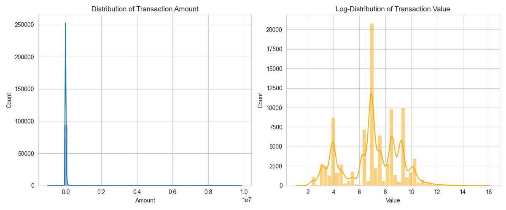
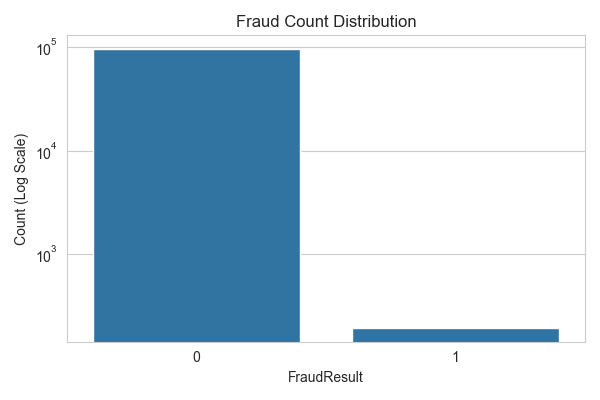
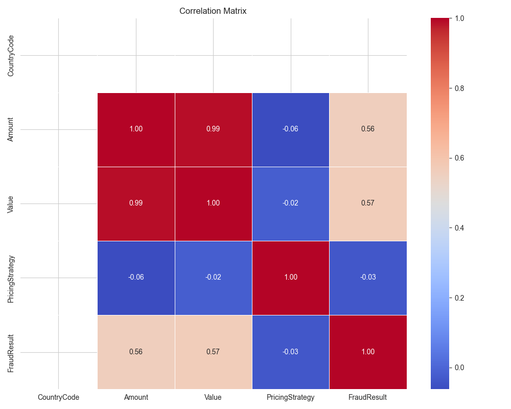
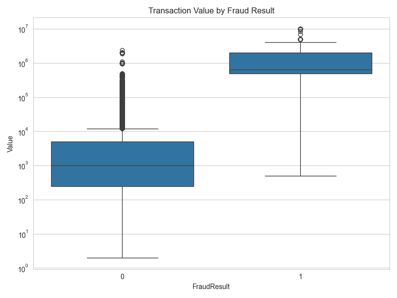

# Interim Report - Data Analysis Summary

## 1. Dataset Overview
- **Total Rows:** 95662
- **Total Columns:** 16
- **Missing Values:** 0 total missing cells.

## 2. Key Observations
### Class Imbalance (FraudResult)
- **Non-Fraud (0):** 95469
- **Fraud (1):** 193
- **Fraud Rate:** 0.20%

### Numerical Statistics
|       |   CountryCode |        Amount |         Value |   PricingStrategy |    FraudResult |
|:------|--------------:|--------------:|--------------:|------------------:|---------------:|
| count |         95662 |  95662        |  95662        |      95662        | 95662          |
| mean  |           256 |   6717.85     |   9900.58     |          2.25597  |     0.00201752 |
| std   |             0 | 123307        | 123122        |          0.732924 |     0.0448717  |
| min   |           256 |     -1e+06    |      2        |          0        |     0          |
| 25%   |           256 |    -50        |    275        |          2        |     0          |
| 50%   |           256 |   1000        |   1000        |          2        |     0          |
| 75%   |           256 |   2800        |   5000        |          2        |     0          |
| max   |           256 |      9.88e+06 |      9.88e+06 |          4        |     1          |

### Skewness
High skewness observed in:
- **Amount:** 51.10
- **Value:** 51.29
- **PricingStrategy:** 1.66
- **FraudResult:** 22.20

## 3. Visualizations

### Transaction Amount Distribution

### Fraud Distribution (Log Scale)

### Correlation Matrix

### Outlier Detection: Value vs Fraud

